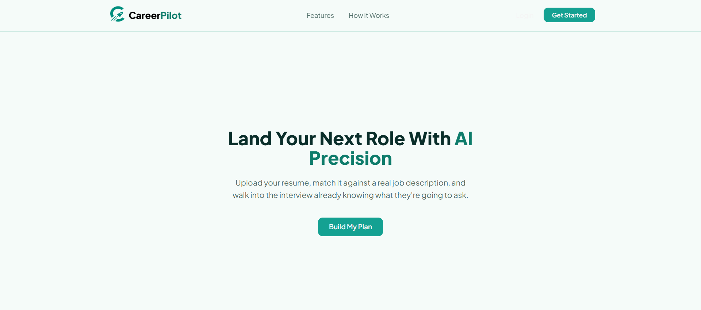
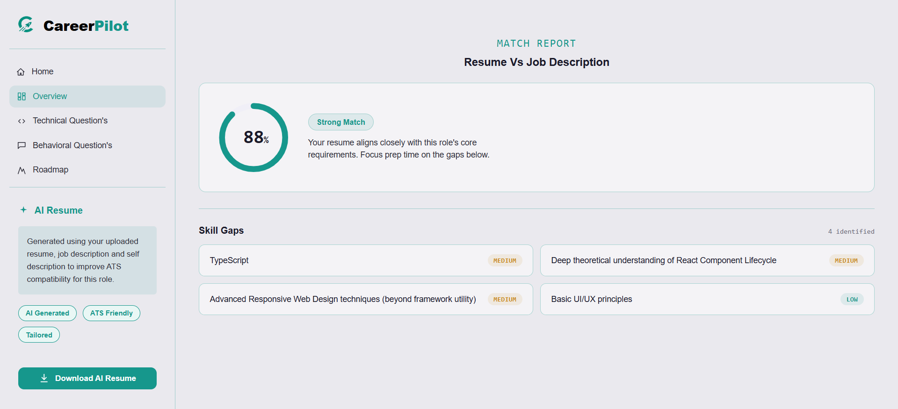
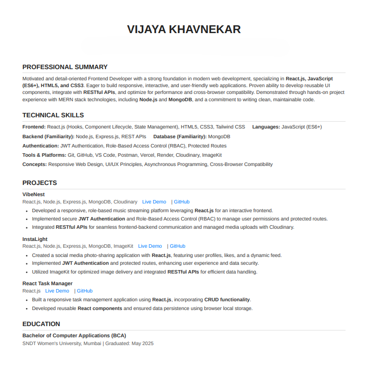
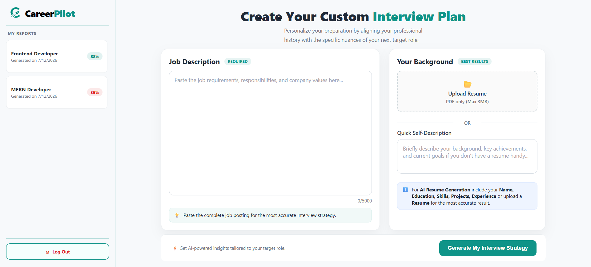

# CareerPilot

An AI-powered interview preparation platform built on the MERN stack, using Google Gemini to generate tailored interview questions, skill-gap analysis, and ATS-optimized resumes based on a candidate's profile and target job description.

**Live demo:** [career-pilot-bay-phi.vercel.app](https://career-pilot-bay-phi.vercel.app/)

> Note: the backend is hosted on Render's free tier, which spins down after periods of inactivity. The first request after idle may take 30–50 seconds to respond while the server wakes up — this is expected, not a bug.

---

## Screenshots

| Landing Page | Interview Report |
|---|---|
|  |  |

| Resume PDF Output | Home Dashboard |
|---|---|
|  |  |

---

## Features

- **AI-generated interview reports** — technical and behavioral questions tailored to a job description and candidate profile, with a match score, skill-gap analysis, and a personalized multi-day preparation plan (powered by Google Gemini)

- **ATS-optimized resume generation** — rewrites and tailors an uploaded resume for a target role, exported as a clean, single-page PDF

- **Secure authentication** — JWT access/refresh token rotation, session-based revocation, and rate limiting on auth and AI routes

- **Resume upload** — optional PDF resume parsing to enrich AI context

- **Responsive UI** — light, minimal design system with a teal accent, including a collapsible sidebar for mobile

---

## Tech Stack

- **Frontend:** React, React Router, SCSS, Vite, Axios
- **Backend:** Node.js, Express, MongoDB (Mongoose)
- **AI:** Google Gemini API
- **Auth:** JWT (access + refresh tokens), httpOnly cookies
- **PDF Generation:** Puppeteer
- **File Uploads:** Multer, pdf-parse
- **Deployment:** Vercel (frontend), Render (backend), MongoDB Atlas (database)

---

## Local Setup

### Prerequisites
- Node.js (v18+)
- A MongoDB Atlas cluster (or local MongoDB instance)
- A Google Gemini API key

### 1. Clone the repo
```bash
git clone https://github.com/ViJaya-kh22/CareerPilot.git
cd CareerPilot
```

### 2. Backend setup
```bash
cd Backend
npm install
```

Create a `.env` file in `Backend/` with the following variables:

```
NODE_ENV=development
MONGO_URI=
JWT_ACCESS_SECRET=
JWT_REFRESH_SECRET=
GEMINI_API_KEY=
CLIENT_URL=http://localhost:5173
```

Start the backend:
```bash
npm run dev
```

### 3. Frontend setup
```bash
cd frontend
npm install
```

Create a `.env` file in `frontend/` with:

```
VITE_API_URL=http://localhost:3000
```

Start the frontend:
```bash
npm run dev
```

The app should now be running locally, with the frontend on `http://localhost:5173` and the backend on `http://localhost:3000`.

---

## Environment Variables Reference

| Variable | Where | Purpose |
|---|---|---|
| `NODE_ENV` | Backend | Set to `production` on deploy to enable cross-domain cookie flags |
| `MONGO_URI` | Backend | MongoDB Atlas connection string |
| `JWT_ACCESS_SECRET` | Backend | Signing secret for short-lived access tokens |
| `JWT_REFRESH_SECRET` | Backend | Signing secret for refresh tokens |
| `GEMINI_API_KEY` | Backend | Google Gemini API key |
| `CLIENT_URL` | Backend | Deployed frontend origin, used for CORS |
| `VITE_API_URL` | Frontend | Backend API base URL |

---

## Known Limitations

- Render's free tier cold-starts after inactivity (~30–50s first response)
- Resume PDF generation depends on Puppeteer/Chrome being available in the deploy environment — configured via a `postinstall` script and a custom `PUPPETEER_CACHE_DIR`
- AI-generated content quality depends on the specificity of the job description and resume/self-description provided

---

## License

This project was built as a personal portfolio project.